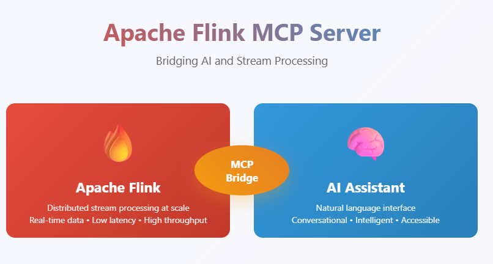

# Apache Flink MCP Server

A Model Context Protocol (MCP) server implementation for Apache Flink that enables AI assistants and large language models to interact with Flink clusters through natural language interfaces. This server provides comprehensive tools for monitoring, managing, and analyzing Apache Flink streaming applications.



## Overview

The Apache Flink MCP Server bridges the gap between AI assistants and Apache Flink clusters by providing a standardized MCP interface. It allows users to perform complex Flink operations through conversational AI, making stream processing management more accessible and intuitive.

## Configuration

No configuration file is required. The server starts without any pre-configured connection. Use the `initialize_flink_connection` tool to point it at your cluster at runtime:

```
initialize_flink_connection(flink_url="http://localhost:8081")
```

The connection is validated immediately — the tool pings `/overview` and returns an error if the cluster is unreachable. All other tools will raise a clear error if called before the connection is initialized.

| Setting | Value | Description |
|---------|-------|-------------|
| Transport | `streamable-http` | HTTP server on `127.0.0.1:9090` |
| TLS verification | disabled | `verify=False` on all requests (suits self-signed certs) |
| Max output chars | `50000` | Longer responses are truncated automatically |

## Features

### 🎯 Core Capabilities
- **Cluster Monitoring**: Get real-time cluster information including jobs, slots, and TaskManagers
- **Job Management**: List, monitor, and analyze Flink job details and metrics
- **Exception Tracking**: Retrieve and analyze job exceptions for debugging
- **Resource Management**: Monitor TaskManager resources and JAR file deployments
- **Metrics Collection**: Access comprehensive job and cluster metrics

### 🔧 Available Tools (30 total):

**Connection**
| Tool | Description |
|------|-------------|
| `initialize_flink_connection` | Connect to a Flink cluster by URL — must be called first |
| `get_connection_status` | Check whether a connection is active and show the current URL |

**Cluster**
| Tool | Description |
|------|-------------|
| `get_cluster_info` | Overview of the Flink cluster: jobs, slots, TaskManagers |
| `list_jar_files` | Uploaded JAR files |
| `get_cluster_health` | Full cluster health snapshot: slot capacity, TM utilization, active jobs, failures, overall assessment |

**Jobs**
| Tool | Description |
|------|-------------|
| `list_jobs` | All jobs with status |
| `get_job_details` | Comprehensive job details: config, vertices, metrics, plan |
| `diagnose_job` | **Unified health report** — concurrently fetches exceptions, metrics, checkpoint health, and job details; returns a single prioritised report with a one-line health summary |
| `get_job_history` | Run history for a job by name: all runs with states, stability summary, failure pattern |
| `compare_checkpoints` | Checkpoint trend analysis: duration/size trends, outliers, failure list, HEALTHY/DEGRADING/UNSTABLE assessment |
| `get_job_metrics` | Diagnostic metrics report: uptime, restarts, checkpoint stats |
| `get_job_exceptions` | Root cause and exception history for a job |
| `get_job_accumulators` | User-defined accumulators for a job |
| `get_job_plan` | Dataflow DAG with nodes, edges, and ship strategies |
| `get_job_checkpoint_config` | Active checkpoint configuration for a job |

**Checkpoints**
| Tool | Description |
|------|-------------|
| `get_job_checkpoints` | Checkpoint history, counts, and summary for a job |
| `get_checkpoint_details` | Per-subtask breakdown for a specific checkpoint |

**Vertices / Operators**
| Tool | Description |
|------|-------------|
| `get_vertex_details` | Full per-subtask breakdown with I/O metrics and user accumulators |
| `get_vertex_flamegraph` | CPU flame graph data (Flink 1.17+, requires `rest.profiling.enabled: true`) |
| `find_bottleneck` | Identify the bottleneck operator by backpressure ranking; includes root cause candidate and recommendations |

**TaskManagers**
| Tool | Description |
|------|-------------|
| `list_taskmanagers` | All TaskManagers with slot, memory, and CPU details |
| `get_taskmanager_details` | Deep-dive into a single TaskManager including real-time metrics |
| `get_taskmanager_metrics` | Query or list available metrics for a TaskManager |
| `get_taskmanager_thread_dump` | JVM thread dump grouped by state (BLOCKED threads highlighted) |
| `diagnose_taskmanager` | Full TM health report: CPU, heap, GC pressure, thread summary, HEALTHY/UNDER PRESSURE/CRITICAL assessment |

**JobManager**
| Tool | Description |
|------|-------------|
| `get_jobmanager_metrics` | Query or list available JobManager metrics |
| `get_jobmanager_config` | Full effective cluster configuration grouped by key prefix |
| `get_jobmanager_environment` | JVM version, heap size, classpath, and environment variables |

**Logs**
| Tool | Description |
|------|-------------|
| `list_flink_logs` | Available log files on the JobManager or a TaskManager |
| `read_flink_logs` | Read a log file with optional `tail`, `level_filter`, and `keyword` support |

---

### 🚀 Benefits
- **Natural Language Interface**: Interact with Flink using conversational AI
- **Real-time Monitoring**: Get instant insights into cluster and job status
- **Debugging Support**: Easily access exception logs and metrics
- **Resource Optimization**: Monitor resource usage across TaskManagers
- **Developer Productivity**: Reduce time spent navigating Flink Web UI

## Installation

### Prerequisites
- Apache Flink cluster (running and accessible)
- Python 3.8 or higher
- MCP-compatible client (Claude Desktop, Continue, etc.)

### Setup

```bash
pip install -r requirements.txt
python mcp_server.py
```

The server starts on `http://127.0.0.1:9090`. No config file needed.

### Client Configuration

#### Continue.dev
Add to your Continue configuration (`Flink-mcp-server.yaml`):
```yaml
name: Apache Flink MCP
version: 0.0.1
schema: v1
mcpServers:
  - name: Flink MCP Server
    type: streamable-http
    url: http://127.0.0.1:9090/mcp/
```

#### Claude Desktop
Add to `claude_desktop_config.json`:
```json
{
  "mcpServers": {
    "flink": {
      "type": "streamable-http",
      "url": "http://127.0.0.1:9090/mcp/"
    }
  }
}
```

## Usage Examples

### First step: connect to your cluster
```
initialize_flink_connection(flink_url="http://localhost:8081")
→ ✓ Successfully connected to Flink cluster at http://localhost:8081
```

### Basic cluster monitoring
```
Human: What's the status of my Flink cluster?
→ get_cluster_info
```

### Job analysis
```
Human: Show me all running jobs and their performance metrics
→ list_jobs, then get_job_metrics for each job of interest
```

### Troubleshooting a failing job
```
Human: My job abc123 keeps restarting — what's wrong?
→ diagnose_job("abc123")
   Returns: health summary + exceptions + metrics + checkpoint health + job details in one call
```

### Resource investigation
```
Human: Which TaskManager is under memory pressure?
→ list_taskmanagers, then get_taskmanager_details for the suspect node
```

### Thread dump for deadlock diagnosis
```
Human: A TaskManager seems stuck. Get a thread dump.
→ get_taskmanager_thread_dump("172.20.0.3:38373-66c42c")
```

## Project Structure

```
mcp_server.py          # Entry point — registers tools, starts server
code/
├── app.py             # Shared FastMCP instance
├── utils.py           # format_bytes, format_duration, format_timestamp, to_num, index_by_id, chunk
├── connection.py      # FLINK_CONNECTION state, get_settings(), initialize/status tools
├── cluster_tools.py   # get_cluster_info, list_jar_files, get_cluster_health
├── job_tools.py       # list_jobs, get_job_details, diagnose_job, get_job_metrics,
│                      # get_job_exceptions, get_job_accumulators, get_job_plan,
│                      # get_job_checkpoint_config, get_job_history, compare_checkpoints
├── checkpoint_tools.py# get_job_checkpoints, get_checkpoint_details
├── vertex_tools.py    # get_vertex_details, get_vertex_flamegraph, find_bottleneck
├── taskmanager_tools.py # list_taskmanagers, get_taskmanager_details,
│                        # get_taskmanager_metrics, get_taskmanager_thread_dump,
│                        # diagnose_taskmanager
├── jobmanager_tools.py# get_jobmanager_metrics, get_jobmanager_config,
│                      # get_jobmanager_environment
└── log_tools.py       # list_flink_logs, read_flink_logs
```

---

## Troubleshooting

**Not connected error**
All tools return a clear error if called before `initialize_flink_connection`. Call it first with your cluster URL.

**Connection failed**
- Confirm the Flink REST API is reachable: `curl http://<host>:8081/overview`
- Check that `rest.bind-address` is not restricted to localhost inside the cluster

**Permission errors**
- Verify the Flink REST API is enabled (`rest.enabled: true`)
- Check whether your setup requires authentication headers

**Debug logging**
```bash
python mcp_server.py
# Logs go to stderr at INFO level by default
```

## Contributing

We welcome contributions! Please follow these steps:

1. Fork the repository
2. Create a feature branch: `git checkout -b feature-name`
3. Make your changes and add tests
5. Commit your changes: `git commit -m "Add feature"`
6. Push to your fork: `git push origin feature-name`
7. Create a Pull Request

### Development Guidelines
- Follow PEP 8 style guidelines
- Update documentation as needed
- Ensure backward compatibility

## License

This project is licensed under the [MIT License](LICENSE).

## Related Projects

- [Model Context Protocol](https://github.com/modelcontextprotocol) - The MCP specification
- [Apache Flink](https://github.com/apache/flink) - Apache Flink stream processing framework
- [MCP Kafka](https://github.com/Ashfaqbs/KafkaIQ) - MCP server for Confluent/Kafka
- [MCP Container](https://github.com/Ashfaqbs/ContainMind) - MCP server forContainer's


## Support

- **Issues**: [GitHub Issues](https://github.com/Ashfaqbs/apache-flink-mcp-server/issues)
- **Documentation**: [Project Wiki](https://github.com/Ashfaqbs/apache-flink-mcp-server/wiki)

- **Discussions**: [Project Discussions](https://github.com/Ashfaqbs/apache-flink-mcp-server/discussions/)

## Acknowledgments

- Apache Flink community for the excellent stream processing framework
- Model Context Protocol team for the standardized interface
- Contributors and users of this project

---

**Note**: This MCP server provides read-only access to Flink cluster information by default. For write operations, additional configuration and security considerations may be required.
